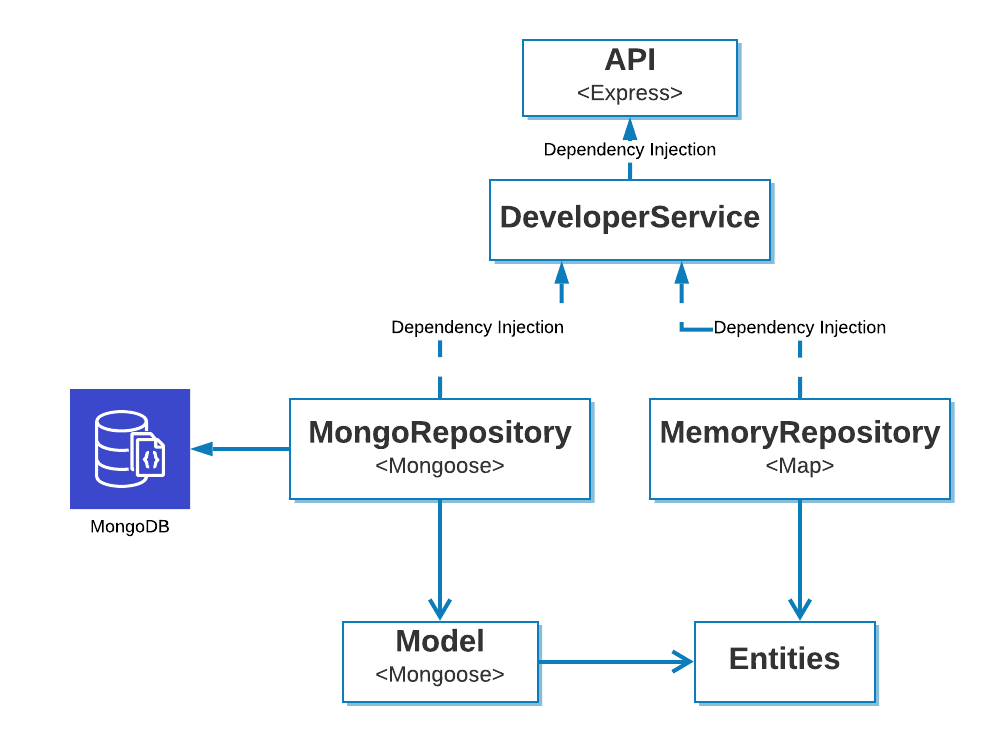

# Developer API
**Autor:** Elio Quevedo <*esqs.quevedo1994@gmail.com*>

## Descripción
El presente proyecto corresponde a un microservicio para la gestión de la información de desarrolladores, incluyendo las operaciones CRUD (Creación, eliminación, modificación, lectura) para el manejo de sus registros. La información necesaria para representar a un desarrollador es:

* nombres_completos: <String>
* link_github: <String>
* tecnologias_conocidas: <Array<String>>

## Arquitectura
El código fuente de la presente aplicación está disponible en el directorio src. El lenguaje de programación usado para el desarrollo es Javascript ES6 mediante el framework NodeJS.

La arquitectura usada es mediante división en capas a la cual se le adapta un principio de *Clean Architecture* que fue propuesto por Robert C. Martin. Esta arquitectura se puede visualizar en la Figura 1.



En este modelo se busca tener componentes que sean independientes de la implementación y modelos dependientes de la misma. Los modelos independientes corresponden a las entidades y los servicios.

#### Arquitectura Independiente

##### Entidades
Las entidades se refieren a las diferentes clases o abstracciones del dominio. En el presente proyecto están localizadas en el directorio *src/server/entities*.

##### Servicios
Los servicios es un conjunto de clases que permite que otros componentes de la capa externa de la aplicación puedan interactuar con las diferentes entidades. Estos servicios durante su construcción reciben un repositorio el cual les permite almacenar los datos. Para ello, se espera que estos repositorios compartan los mismos métodos y generen los mismos resultados. Están localizadas en el directorio *src/server/services*. 

#### Arquitectura Dependiente de la Tecnología

###### Repositorio
Es el componente de la aplicación encargado de la persistencia de los datos ingresados por los usuarios. En este caso existen dos tipos de repositorios: uno que permite almacenar los datos en la memoria del servidor mediante un HashMap (`MemoryRepository`) y otro que permite almacenar en una base de datos de MongoDB (`MongoRepository`). Considerando que Javascript ES6 no provee interfaces, no es posible forzar a las dos clases a que tengan la misma definición y que esta sea revisada en tiempo de compilación. Por tanto, se debe garantizar que ambas provean los mismo métodos y atributos para el servicio. Adicionalmente, MongoRepository no interactúa directamente con las entidades, esto es debido a que la librería *Mongoose* requiere que se defina un modelo bajo su propia sintaxis. Con el objetivo de no incluir información de *MongoDB* en el dominio, se ha creado una clase adaptadora llamada *serializer* la cual permite la conversión entre la representación específica de plataforma con la independiente y visceversa.

##### API
La API expone los recursos de la aplicación a consumidores externos mediante un servicio REST. Este componente depende de ExpressJS para la creación de las diferentes rutas y del servidor. Como dependencia interna requiere del servicio de la capa media de la aplicación. Esto permite que se pueda usar otro *framework* para ofrecer un nuevo mecanismo de interacción.

## Configuración
En el archivo src/config/default.json se especifican los parámetros de configuración para el sistema. Estos son:

* `developerApi.serverConfig.port` : Puerto en el cual escucha el servidor una vez ha sido configurado y desplegado.
* `developerApi.repositoryConfig.isMemoryRepository`: Valor de tipo *Boolean*. Cuando es *True* el servidor usa una estructura de datos interna para almacenar la información de los desarrolladores. Si es *False* el servidor usa MongoDB como repositorio.
* `developerApi.repositoryConfig.mongoBaseUrl`: Si el valor del parámetro de configuración *isMemoryRepository* es *False*, corresponde a la cadena de texto usada para la conexión con el servidor de MongoDB.

## Despliegue
Este servidor puede ser desplegado dentro de un contenedor de Docker o en su defecto de manera local en una máquina que tiene instalado Nodejs.

### Despliegue en Docker
##### Prerequisitos
* Se considera que el usuario ha instalado docker previamente en la máquina en la cual se realizará el despliegue del servidor. Caso contrario, puede consultar el proceso para realizarlo en su sistema operativo desde la documentación oficial de [Docker](https://docs.docker.com/get-docker/).
* Cambiar el directorio de trabajo a la raiz del presente proyecto mediante el comando *cd*.

###### Pasos
1. Construir la imagen para el contenedor a partir del correspondiente Dockerfile. Como opción del parámetro tag se especifica el nombre para la imagen y su versión. En este caso la imagen se denomina *developer_api*.

```
$ docker build --tag developer_api:1.0 .
```

2. Inicializar el contenedor a partir de la imagen creada en el paso anterior.

```
$ docker run --publish 8000:8000 -it --name prod_developer_api developer_api:1.0 sh
```

# Despliegue Local
Permite realizar el despliegue en un servidor de aplicaciones de Nodejs. Este caso es útil durante el desarrollo del microservicio.

##### Prerequisitos
* Se considera que la maquina en la cual se realizará el despliegue tiene instalada la versión 12.18.0 (LTS para la fecha 14/06/2020) de Node JS.
* Cambiar el directorio de trabajo a src.

```
$ cd ./src
```

###### Pasos
1. Instalar las dependencias de desarrollo y ejecución.

```
$ npm install
```

2. Debido a que el proyecto usa Javascript ES6 se debe compilar previamente para la versión estable de Node JS.

```
$ npm run build
```

3. Ejecutar el servidor.

```
$ npm run start
```

## API
Los servicios para manejar los recursos de información de los desarrolladores y que no requieren autorización son:

* [Listar desarrolladores](docs/api/listDev.md) : `GET /developers/`
* [Crear desarrolladores](docs/api/addDev.md) : `POST /developers/`
* [Modificar los desarrolladores](docs/api/updateDev.md) : `PUT /developers/:id/`
* [Eliminar desarrolladores](docs/api/deleteDev.md) : `DELETE /developers/:id/`